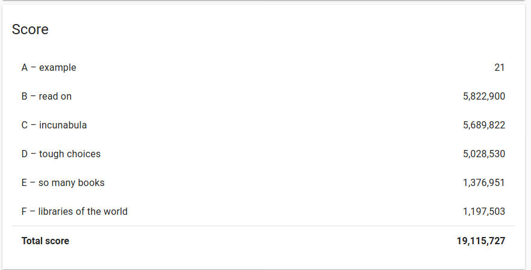

# GoogleHashCode2020
For a description of the challenge, see the file named "hashcode_2020_online_qualification_round.pdf"

This was written during the Extended round of the Google HashCode 2020 competition, mainly as a means to refresh numpy skills, and experiment with numpy array masking. 

Problem D had some particularities in terms of the data, in that all libraries had an equally long sign-up time, and could send an equal amount of books every day. Additionally, each book had the same score. Because of this, a separate script was created for problem D. All other problems were solved with the main script. 

These are the scores obtained at the end: 

